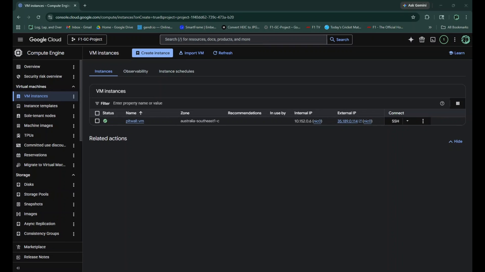
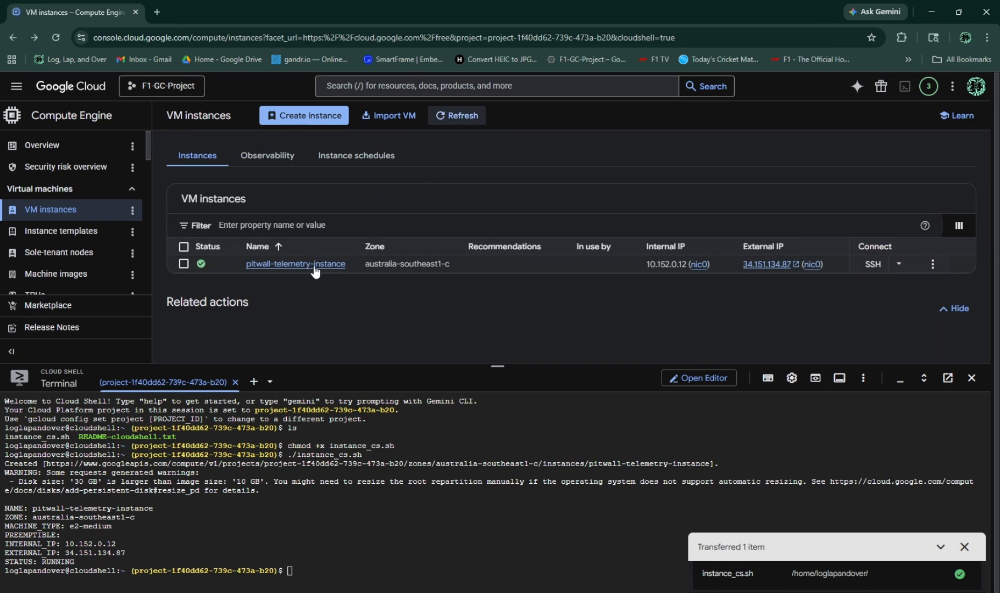

# The Art of Google Cloud (Part 1): The Three-Month Free Trial

_Project Timeframe: 9 May 2026 - present_

_Link to blog post:_ coming soon

### Intro

I've decided to give some tech content that is based on the field that I want to get into for an IT career. My main goal is to get into some work based on the DevOps and the security field, become a Cloud Engineer, a Systems Administrator, someone who works behind the scenes with IaC, Infrastructure as Code.

I will also be screen recording every process of this so that I can have actual video evidence of how the process is going to work. I will also have a Github repository I can put these videos in and all the documents.

### Project Ideas

Every project needs some kind of theme that will keep me interested in it. This is a major project for me, and I like to combine my interests outside of IT for it. So I could do a Formula 1 themed project, a music themed one (a Beatles one would work), or even one that would put me in a scenario of what kind of real project I would work on in the real world, in the real industry.

I ended up deciding on some kind of **Formula 1 themed project**, because there is always new data occuring in the space of three months (give or take), and it's during the season. It's worth noting that the McLaren F1 Team have Google as one of their major sponsors, and it's most likely what they'd use for their tech infrastructure. However they have the privilege to use all the good technology that isn't free-tier and would cost millions of dollars, so I want to replicate it as realistically as possible with **only free-tier tools** for this trial to have it on real time. This includes preparing for each stage for a race weekend, and things like automation, scripting, and scheduling would be beneficial for this project in particular.

---
### Project Infrastructure

The overall infrastructure of the project is going to simulate a small-scale real world cloud environment that could realistically be used by a racing team during a Formula 1 season. The goal here is not simply deploying applications to the cloud, but rather building an environment that actually resembles how modern infrastructure operates behind the scenes.

This project will most likely revolve around multiple small services rather than one large application. Some services may handle race weekend data, others could manage telemetry-style information, automation tasks, scheduling, monitoring, or APIs that fetch live Formula 1 data from external sources. Running several services instead of one large monolith also gives me the opportunity to work with containerisation and orchestration tools properly.

The architecture of this project is structured around a **central Kubernetes-based system** running inside Google Cloud, which acts as the main orchestration layer for all services. Instead of treating each component as a standalone application, everything is designed to work as part of a connected ecosystem, similar to how real production environments operate in industry. At the core of the system is a cluster running on **Google Kubernetes Engine (GKE)**, where all containerised services are deployed and managed. These services are built as **independent FastAPI applications**, each responsible for a specific function such as handling Formula 1 data, processing telemetry-style inputs, managing scheduled tasks, or exposing APIs for data access.

Supporting the application layer is a structured data system built around **PostgreSQL**, which is a database platform that stores persistent and relational data generated by the services. This ensures that all processed information can be queried and reused across different parts of the system.

To make the environment observable and maintainable, monitoring and logging are built into the infrastructure from the start. **Prometheus** collects metrics from both the cluster and individual services, while **Grafana** is used to visualise system performance through dashboards, and **Loki** aggregates logs from all running containers to provide a unified debugging and tracing system.

Outside of the Kubernetes environment, **Compute Engine** instances, which are basically virtual machines, are used for additional workloads that do not need to run inside the cluster, such as isolated testing environments or supporting services. **Cloud Storage** is used as an external persistence layer for backups, exported data, and long-term storage needs.

The infrastructure itself is defined using Terraform, ensuring that all cloud resources can be provisioned and rebuilt consistently through code rather than manual setup. Deployment and update workflows are automated using **GitHub Actions**, which handle continuous integration and delivery into the Kubernetes cluster.

Finally, the system relies on a Linux-based foundation using the latest Ubuntu Live Server (26.04 LTS, **not** the desktop one), where **Bash scripting** and **Cron jobs** are used to automate recurring operational tasks such as backups, scheduled data collection, and system maintenance.

---

### Free-tier Barriers

In this free trial I do have to be careful with what resources to use, in case it does take off a bit of money in my bank account. I do have about NZD $510 worth of credits to use in that three-month trial. Google Cloud free-tier services have limits around compute time, storage usage, and managed services, so the architecture needs to stay lightweight and intentional.

The main risks are over-provisioning Compute Engine instances, running Kubernetes clusters that exceed free-tier allowances, and leaving resources running when they are not needed. Storage and logging can also grow quickly if not managed properly.

To stay within limits, the project will focus on minimal instance sizes, efficient container usage, and shutting down or scaling down resources when they are not actively being used. Wherever possible, automation will also be used to prevent unnecessary resource consumption.

---
## Phases of the Project

This project will be broken down into several phases, documented as a 3-part blog series:

* **Part 1** covers **Phase 1 and Phase 2**, focusing on the initial working system and core infrastructure setup.

  * **Phase 1 (Core system build):** Google Cloud Console (Compute Engine, VPC networking, firewall rules), Ubuntu Server, SSH, Docker, Docker Compose, FastAPI, PostgreSQL
  * **Phase 2 (Infrastructure automation):** Google Cloud Console + Cloud Shell, `gcloud` CLI, startup scripts, instance templates, Docker, Docker Compose, also getting some real F1 data to use.

* **Part 2** covers **Phase 3, Phase 4, and Phase 5**, focusing on scaling, orchestration, observability, and security using managed Google Cloud services.

  * **Phase 3:** Google Kubernetes Engine (GKE)
  * **Phase 4:** Cloud Monitoring + Cloud Logging (Operations Suite)
  * **Phase 5:** IAM, VPC firewall policies, Secret Manager

* **Part 3** covers **Phase 6 and Phase 7**, focusing on production automation and system integration.

  * **Phase 6:** Cloud Build (CI/CD pipelines)
  * **Phase 7:** Artifact Registry (container management), Terraform (Infrastructure as Code, optional but strong DevOps signal)

---

### Phase 1 and 2 Breakdown (What is being built)

**Phase 1** focuses on setting up the environment required to run the system and building the initial working application. This includes creating the GitHub repository itself, then provisioning the Google Cloud Compute Engine instance, configuring Ubuntu Server, setting up SSH access, installing Docker, and preparing the basic infrastructure needed to run containers reliably. A FastAPI service is then created, containerised using Docker, and connected to a PostgreSQL database. This results in a fully working but minimal cloud deployment that can handle simple API requests and data storage.

**Phase 2** builds on top of this foundation by introducing infrastructure automation and improving deployment repeatability. This includes automating Google Cloud Compute Engine instance creation using `gcloud` CLI and Cloud Shell, leveraging startup scripts and instance templates to standardise environment setup, and streamlining the provisioning of networking and compute resources through Google Cloud Console configurations. The existing Docker and Docker Compose setup is retained to maintain consistent application deployment, but is now integrated into a more automated and reproducible infrastructure workflow.

---
## Part 1 (Phases 1 & 2): Initial Working Demo (Start of Build)

To begin the project, I am **not** starting with the full architecture immediately, because that's gonna be too complicated and time-consuming. Instead, the first milestone is a simplified working version of the system that proves the core concepts in a real environment. But the first thing I did was not even set up the Google Cloud Free Trial, it's creating the GitHub repository for it.

---

### Phase 1 - Creating the Virtual Machine and Containers

 

The first thing I did when I got to the Google Cloud Console was to enable the **Compute Engine API** and create a virtual machine called "pitwall-vm". I just used the latest version of the Ubuntu Live Server (not desktop, and the version is 26.04 LTS), put in the default RAM and about 30G of storage and connected through with SSH in Google, which I have found out is slightly different than just connecting through apps like PuTTY or just regular SSH with the External IP address it gives you. From there I ended up going into the root user because the regular user wasn't working properly with sudo permissions, and I couldn't add to the sudo group for some reason. So I just ended up installing Docker and did a basic update. I then made a docker compose file to make both the FastAPI and PostgreSQL containers at the same time, even though you can just use dockerfile for each container, but compose is far easier to setup if you're doing multiple containers, and from there you just run both at the same time and access them. But first I had to create an environment file to securely store the database credentials, then do a docker compose file to reference the environment variables file for it to use. For the FastAPI container, I had to create a Python-based Docker image for this to work. 

This initial demo consists of a single **FastAPI service** running inside a Docker container, deployed on a Google Cloud Compute Engine instance running Ubuntu Server. The service connects to a **PostgreSQL** database and exposes basic endpoints for storing and retrieving sample Formula 1-style data. At this stage, the goal is not scalability or full orchestration, but validation. The focus is on confirming that the full pipeline works end-to-end in a minimal form: application → container → cloud deployment → database.

---

### Phase 2 - Scripting and Automating the VM Process

 

Phase 2 is basically just doing the same in Phase 1, but instead of actually using the Google Cloud Console, you're actually using Google Cloud CLI and Bash, so everything is setup in a quicker process than just doing it from the console. What I've noticed when creating the VM in Phase 1 is that there is an "Equivalent code" section, so I went through the exact same process of creating the VM with a slightly different name to differentiate from the other one, but with the exact same specs. This was by far my favourite phase as **automating everything into a script is my strong suit** when it comes to any IT task, because I always like to find ways to make simple tasks scriptable and make life a bit easier. Also, AI tools aren't always reliable for this, because speaking from experience the code is generally choppy and repetitive, and it tends to generate older versioning of software or software that is now deprecated, which isn't always ideal if a client wants the absolute latest of software for better usage.

There is more than one way to run this. One way is on your local computer via a bash script (or powershell script), provided you actually install and authenticate your Google Cloud account with either the browser or a service account. This example used the browser, just to make it a little easier for myself, but I will incorporate the service account key to further automate this process later. The video demonstration above doesn't show this because I already had it authenticated previously but it had initial errors with the script. The browser authentication is basically just the Google Cloud SDK link from the terminal telling you to allow everything it's supposed to do to create the VM in the first place. 

Another way to create this VM is through the **Cloud Shell terminal** inside the Google Console, where you don't need to go out of your way to install the gcloud stuff and it's already set into your project's ID. It's quite similar to the Azure Cloud Shell if you've used Microsoft Azure before. From there you can either just **copy and paste** the equivalent code you need to create the VM into the terminal, or you could just **upload a script** with the same gcloud VM creation commands.

One last thing, within SSH access to the VM there is an upload button from there too to upload some scripts for setup (I just moved it to the root user as wel). Inside my project repository there are two scripts for me to setup exactly what I did in Phase 1, one for just your basic things to install and update, the other to create the needed directories and files and create a couple of containers with Docker Compose. Note that my scripts all have placeholders in them so that other people can use them, but I do have my own scripts to use locally. This has all been combined into one combined script, but there's two seperate scripts as well because I wanted to show the separate functionalities you can do. But ideally you would run your VM creation script either locally or via Cloud Shell, then inside the VM upload that big combined script (I have named it `install-stack.sh`) into it and set up all the data from there. 

All of the scripts in this repository have all been run and verified locally, so they should have no errors and does exactly what it's supposed to do, just add your own details if you do use them. I have both bash and PowerShell for the VM creation process as well for your convenience. But the most important thing is that you **need to understand** what you're actually doing in the process **manually** in the console first, before you dive deep into the automation part. 

---
## The Formula 1 part of the project

 

- I have replaced the testing mock data from my Python app with an actual API, called [OpenF1](https://openf1.org/docs/#api-endpoints), that stores data on the races, but the catch is that the actual real-time data requires a paid subscription, and I don't want to pay any money right now, so I'll have to make do with the data I can access, which is some historical data, that can be checked post-race.